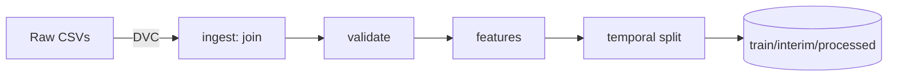
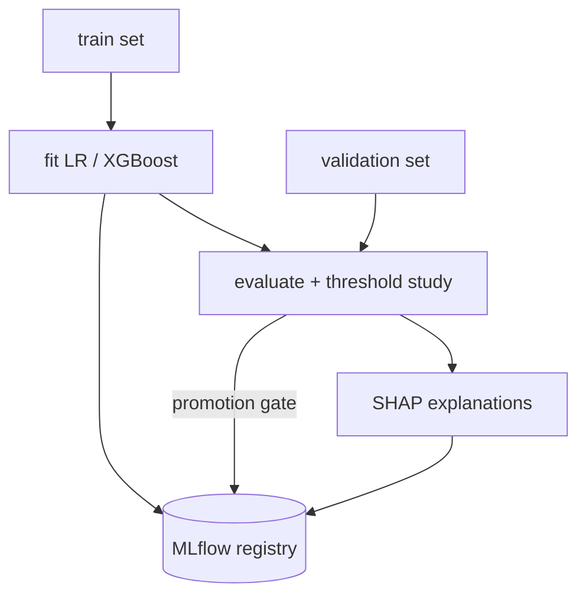
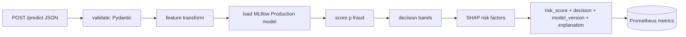
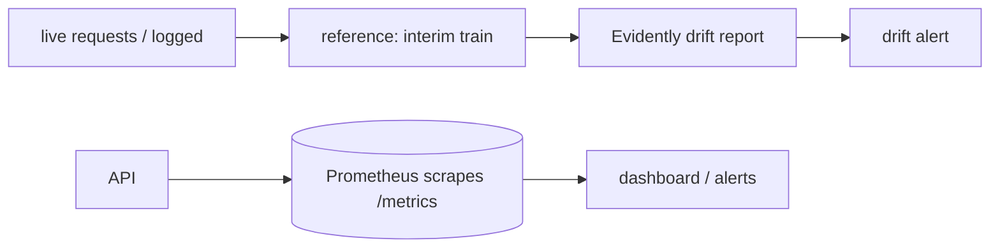

# ARCHITECTURE.md

## Overview

The platform moves from raw IEEE-CIS CSVs to a monitored production inference service.
Two independent flows: an **offline training pipeline** and an **online inference
service**, plus a **monitoring** loop. Data is versioned with DVC; experiments with
MLflow.

## Major components & responsibilities

| Component | Responsibility | Technology |
|---|---|---|
| DVC | Version raw/interim/processed data + pipeline | DVC (local remote) |
| Ingest | Join transaction + identity on `TransactionID` | pandas |
| Validate | Schema / null / range / temporal-order checks | custom + pandas |
| Features | Deterministic, documented transforms; time-safe aggregates | pandas/numpy |
| Split | Chronological temporal split + manifests | custom |
| Train | Baseline (LR) + candidate (XGBoost), imbalance handling | sklearn, xgboost |
| Evaluate | PR-AUC, precision/recall/F1, threshold study | sklearn, pandas |
| Explain | Per-prediction SHAP risk factors | shap |
| Tracking | Experiments + model registry + promotion | MLflow |
| API | `/predict`, `/health`, `/model`, `/metrics` | FastAPI, Pydantic |
| Container | Reproducible image | Docker |
| CI | Lint, type-check, tests, smoke | GitHub Actions |
| Monitoring (system) | Request/latency/error metrics | Prometheus |
| Monitoring (ML/data) | Drift, missingness, prediction dist | Evidently |

## Data flow

## Training flow

## Inference flow

## Model lifecycle

1. Train candidate → log to MLflow.
2. Evaluate on validation + hold-out; record metrics + threshold.
3. Promotion gate: must beat production PR-AUC, meet min precision/recall at operating
   threshold, pass tests + data validation, hold on key slices.
4. Register as `Production`; API loads `Production` at startup.

## Monitoring flow

## Technology choices

- **FastAPI** over Flask: native async, Pydantic, auto OpenAPI, simple to containerize.
- **MLflow** for tracking + registry: standard, covers experiments and lifecycle.
- **DVC** for data versioning without committing large CSVs.
- **Evidently** for drift: purpose-built, integrates with batch checks.
- **Prometheus** for system metrics: pull-based, minimal, pairs with `/metrics`.
- **Docker + PaaS** (no K8s): simplest deploy satisfying requirements.

See `DECISIONS.md` for the rationale behind each choice.
